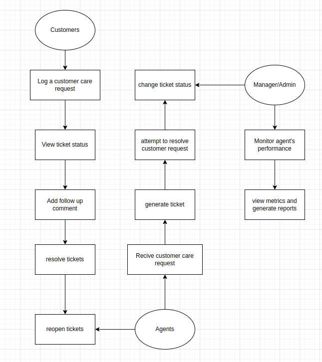
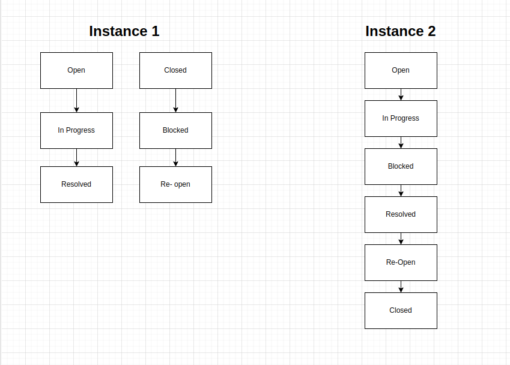
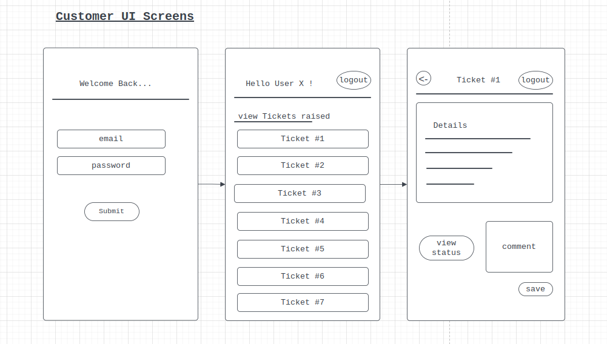
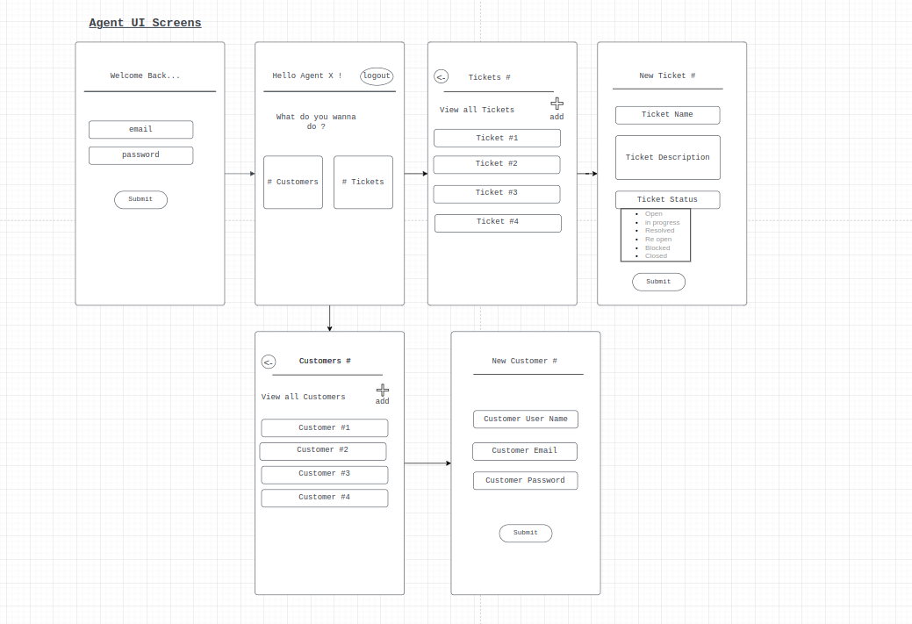
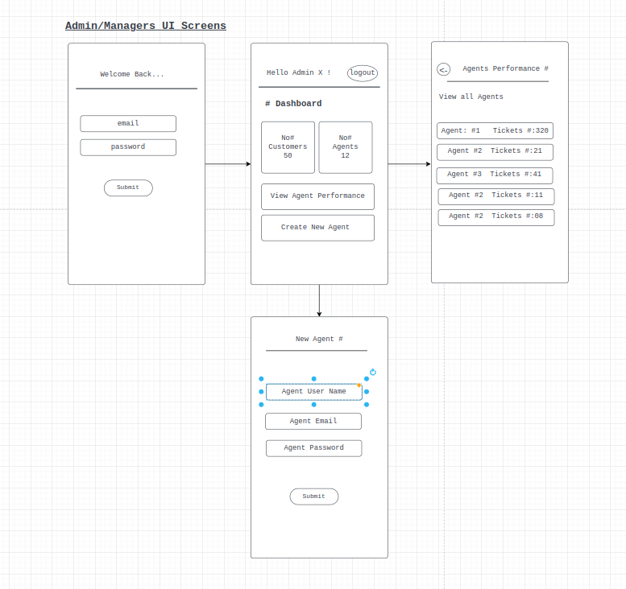

# User Stories for Acme Corp's Customer Care Portal
## As a customer, I want to :

* Log a customer care request via phone call, email, chat, SMS or Whatsapp
* Receive an acknowledgement of my request and a ticket number for reference
* View the status of my ticket on the customer portal
* Add follow-up comments to my ticket, including attachments if necessary
* Resolve my ticket if my issue has been satisfactorily addressed
* Re-open my ticket if my issue has not been conclusively handled

## As an agent, I want to :

* Receive customer care requests from various channels
* Log the request against the customer's profile and generate a ticket number, title of request, description, and categorization of request
* Attempt to find a solution or advise the customer accordingly
* Log follow-up comments against the ticket, sorted in reverse chronological order on opening the ticket
* Change the status of the ticket according to the workflow: OPEN, IN PROGRESS, BLOCKED, RESOLVED, RE-OPENED, and CLOSED
* Monitor the status of tickets assigned to me and tickets in my queue
* Resolve tickets when the issue has been satisfactorily addressed
* Re-open tickets if the customer's issue has not been conclusively handled

## As a Admin / Manager, I want to:

* Monitor the performance of agents in handling customer requests
* See how many tickets are in progress, closed, etc.
* View metrics such as average handle time, first contact resolution rate, and customer satisfaction score
* Re-assign tickets to different agents or teams if necessary
* Generate reports on the performance of the customer care center
* View historical trends and patterns in customer requests and agent performance.

# Use Case diagram

# State Transition Chart

### instance 1
The diagram shows the different states that a ticket can have during its lifecycle, as well as the possible transitions between them. A ticket starts in the "OPEN" state when it is first created, and can move to "IN PROGRESS" when an agent starts working on it. If the agent cannot proceed due to some reason, the ticket can be marked as "BLOCKED". When the agent finds a solution, the ticket can be marked as "RESOLVED". If the customer is not satisfied with the solution provided and re-opens the ticket, it goes back to the "RE-OPENED" state. Finally, when the customer is satisfied, the ticket can be marked as "CLOSED".

### instance 2
The diagram shows the possible transitions between ticket statuses. The initial state is "OPEN" and the final state is "CLOSED". "IN PROGRESS" is the state when an agent is working on the ticket. "BLOCKED" is the state when an agent is waiting for more information from the customer or from other sources. "RESOLVED" is the state when the agent has found a solution for the customer's request. "RE-OPENED" is the state when the customer is not satisfied with the solution provided by the agent and wants to re-open the ticket. A ticket can be closed by either the agent or the customer when the issue has been satisfactorily addressed.

# UI Designs & Wireframes

## Customer UI

## Agent UI

## Admin UI
